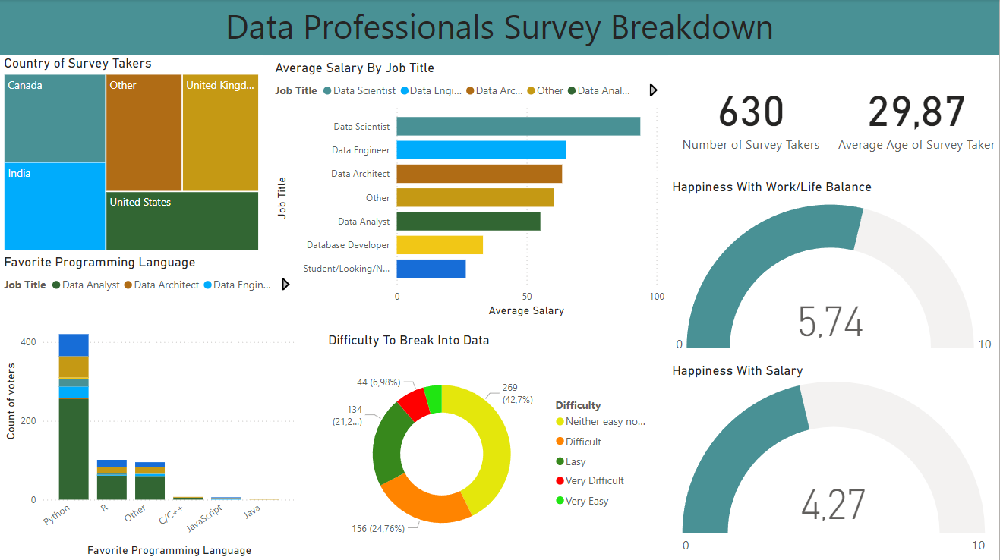

# Power BI Data Professionals Survey Project
In this project we used Power BI to analyse the survey answers of data professionals, to identify patterns amongst data professionals and discover key insights about the field of data analytics. 

## Quick Links
- Data professionals survey dataset: [Data Professionals Survey Dataset](data_professionals_survey_dataset.xlsx)
- Final report: [Report](data_professionals_survey_breakdown.png)
- Power BI file: [Power BI File](data_professionals_survey_project.pbix)
- Other projects I have made: [Portfolio Website](https://lucashoffschmidt.github.io/)

## Technologies Used
- **Power BI**: Data cleaning, data exploration and creating a report.

## Process
- **Data Cleaning in Power Query Editor**:
  - Imported the data professionals survey dataset. 
  - Changed date format from MM/DD/YYYY to DD/MM/YYYY by converting to text and then back to date using the U.S. standard.
  - Removed empty columns and consolidated "Other" responses into a single category by dividing the column by a delimiter. 
  - Created a new average yearly salary by duplicating the salary, dividing the column by delimiter, using custom column logic and changing the format to decimal. 
- **Data Exploration and Report Creation**:
  - Added a headline with a blue background.
  - Created cards for number of survey takers and average age.
  - Made a stacked bar chart for job title vs average salary and a stacked column chart over favorite programming languages.
  - Added a treemap for country distribution and gauges for happiness with work/life balance and salary.
  - Created a donut chart for difficulty breaking into data.
  - Aligned and styled visuals into a report with concise text and updated the theme. 

## Key Findings
- The average data professional is only somewhat happy with their salary and work/life balance.
- Data scientists earn significantly more than other data positions.
- Python is by far the most favored programming language.

## Final Report
**Data Professionals Survey Breakdown**

## Conclusion
Data professionals believe on average that their work/life balance and salary could be better. 

Data scientist is the most profitable position in data and python is enjoyed by most data professionals.
